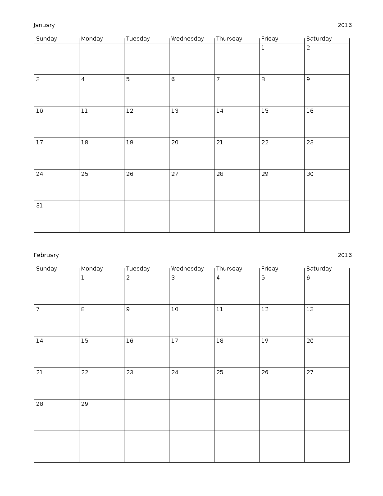

calendar-creator
================
A simple Java program to generate printable calendars. Simply specify
the begin and end date, and the program will generate the appropriate
number of PNG files. Each file has at most two months on it.

Example
-------
Generate calendars for January through May 2016.
```
$ java -jar CalendarCreator.jar --begin 1_2016 --end 2_2016
```


Motivation
----------
I wrote this just for fun and as an easy way to print calendars for
scheduling events.

Installation
------------
To get and build calendar-creator:
```
$ git clone https://github.com/mcastorina/calendar-creator
$ cd calendar-creator
$ make
```
This will build CalendarCreator.jar for use as show in the example above.
